# 🏪 Smart GS24

## 편의점 통합 ERP · 물류 · 재고 · POS 관리 시스템

> **JSP / Java / MySQL 기반 편의점 통합 관리 웹 애플리케이션**
>
> 본사 관리자와 가맹점주의 역할을 분리하고
> **상품 등록 → 발주 → 승인 → 입고 → 재고 관리 → POS 판매 → 매출 조회**까지
> 편의점 운영 과정에서 발생하는 데이터를 하나의 시스템에서 관리할 수 있도록 구현했습니다.

---

# 📌 프로젝트 소개

Smart GS24는 편의점 본사와 여러 가맹점 사이에서 발생하는 상품, 발주, 입고, 재고, 판매 데이터를 통합 관리하기 위해 개발한 ERP 형태의 웹 프로젝트입니다.

단순 CRUD 기능 구현에서 끝나지 않고 실제 편의점 운영 흐름을 참고하여 **본사 관리자(Manager)** 와 **가맹점주(Owner)** 의 권한과 업무를 구분했습니다.

가맹점주는 본사 상품을 조회하여 필요한 상품을 발주하고, 본사의 승인을 받은 상품을 입고 처리하여 매장 재고에 반영할 수 있습니다.

본사 관리자는 전체 가맹점의 상품·점주·발주·행사·매출 데이터를 관리할 수 있도록 구성했습니다.

---

# 🎯 개발 목표

이 프로젝트에서는 다음과 같은 기능을 하나의 업무 흐름으로 연결하는 것을 목표로 했습니다.

```text
본사 상품 등록
      ↓
가맹점 상품 조회
      ↓
가맹점 발주 신청
      ↓
본사 승인 / 반려
      ↓
승인 상품 입고
      ↓
매장 재고 반영
      ↓
POS 판매
      ↓
판매 내역 저장
      ↓
본사 통합 매출 조회
```

이를 통해 단순한 게시판 형태의 웹 개발을 넘어 **여러 테이블과 사용자 권한이 연계되는 업무 시스템**을 구현했습니다.

---

# 🛠 Tech Stack

| 구분              | 기술                                |
| --------------- | --------------------------------- |
| Language        | Java 21                           |
| View            | JSP                               |
| Front-End       | HTML5, CSS3, JavaScript           |
| Database        | MySQL                             |
| DB Access       | JDBC                              |
| Connection      | JNDI DataSource / Connection Pool |
| Server          | Apache Tomcat 9                   |
| Architecture    | JSP + DAO + VO                    |
| IDE             | Eclipse                           |
| Version Control | Git / GitHub                      |

---

# 🏗 시스템 구조

```text
┌─────────────────────────────┐
│           Browser           │
│      Manager / Owner        │
└──────────────┬──────────────┘
               │ HTTP Request
               ▼
┌─────────────────────────────┐
│             JSP             │
│ 화면 출력 / 입력 / 세션 처리 │
└──────────────┬──────────────┘
               │
               ▼
┌─────────────────────────────┐
│             DAO             │
│ Member / Product / Store    │
│ Trade DAO                   │
└──────────────┬──────────────┘
               │ JDBC
               ▼
┌─────────────────────────────┐
│      JNDI DataSource        │
│     Connection Pool         │
└──────────────┬──────────────┘
               │
               ▼
┌─────────────────────────────┐
│            MySQL            │
│ 상품 · 발주 · 재고 · 판매 DB │
└─────────────────────────────┘
```

---

# 👥 사용자 권한

시스템 사용자를 **본사 관리자와 가맹점주**로 구분했습니다.

## 🏢 본사 관리자 Manager

본사의 전체 데이터를 관리합니다.

* 가맹점 및 점주 등록
* 본사 상품 마스터 관리
* 상품 행사 등록
* 전체 가맹점 발주 내역 확인
* 발주 승인 / 반려
* 전체 가맹점 판매 내역 확인
* 통합 매출 확인

## 🏪 가맹점주 Owner

자신이 담당하는 매장을 관리합니다.

* 본사 상품 조회
* 상품 발주 신청
* 자신의 매장 발주 진행상태 확인
* 승인 상품 입고
* 매장 재고 확인
* POS 판매 처리

로그인한 점주의 `store_no`를 Session에 저장하여 자신의 매장 데이터만 조회하도록 구성했습니다.

---

# ✨ 주요 기능

## 1. 🔐 로그인 및 권한 관리

관리자와 점주 계정을 구분하여 로그인합니다.

로그인에 성공하면 Session에 다음 정보를 저장합니다.

```text
id
role
store_no
```

`role` 값에 따라 관리자와 점주의 화면 및 접근 가능한 기능을 구분하고, 점주에게는 담당 매장의 `store_no`를 연결하여 매장별 데이터를 관리합니다.

---

## 2. 🏢 가맹점 및 점주 동시 등록

본사 관리자는 새로운 매장과 해당 매장을 관리할 점주 계정을 함께 등록할 수 있습니다.

등록 과정은 다음과 같습니다.

```text
① STORE 등록
      ↓
② 생성된 store_no 획득
      ↓
③ OWNER 등록
      ↓
④ OWNER ↔ STORE 연결
```

여러 SQL 작업 중 하나라도 실패하면 전체 작업을 이전 상태로 되돌릴 수 있도록 **Transaction의 Commit / Rollback**을 적용했습니다.

---

## 3. 📦 본사 상품 마스터 관리

본사 관리자는 전체 가맹점에서 사용할 상품 데이터를 관리할 수 있습니다.

관리 정보

* 상품번호
* 대분류
* 소분류
* 상품명
* 판매 가격

상품의 대분류와 소분류를 별도의 테이블로 관리하여 상품 데이터와 연결했습니다.

```text
MAIN_CATEGORY
      ↓
SUB_CATEGORY
      ↓
PRODUCT
```

대분류 선택에 따라 소분류 목록이 변경될 수 있도록 구성하여 상품 등록 편의성을 높였습니다.

---

## 4. 🎁 상품 행사 관리

본사 관리자는 상품별 프로모션 정보를 등록할 수 있습니다.

관리 정보

* 대상 상품
* 행사 유형
* 기준 수량
* 할인 / 증정 값
* 행사 시작일
* 행사 종료일

행사 정보는 `product_event` 테이블에 별도로 저장하여 상품 마스터와 분리했습니다.

또한 현재 날짜가 행사 시작일과 종료일 사이에 포함되는지 확인하여 매장 재고 조회 시 현재 적용 중인 행사를 함께 확인할 수 있도록 구성했습니다.

---

## 5. 📋 가맹점 상품 조회 및 발주

점주는 본사에서 등록한 상품 마스터를 조회하고 필요한 상품의 수량을 입력하여 발주를 신청할 수 있습니다.

상품 조회 시 다음 정보를 제공합니다.

* 상품번호
* 대분류
* 소분류
* 상품명
* 소비자 단가
* 발주 수량

발주 신청 시 최초 상태는 **대기** 상태로 저장됩니다.

```text
가맹점 발주 신청
       ↓
     [대기]
       ↓
본사 ──────── 본사
승인          반려
 ↓             ↓
[승인]        [반려]
```

---

## 6. 🚚 본사 발주 승인 / 반려

본사 관리자는 모든 가맹점에서 요청한 발주를 한 화면에서 확인할 수 있습니다.

조회 정보

* 발주번호
* 신청 매장
* 상품명
* 신청 수량
* 총 금액
* 발주 일시
* 현재 상태

아직 처리되지 않은 발주에 대해 **승인 또는 반려** 처리가 가능하며, 처리 완료된 발주는 현재 상태를 화면에서 확인할 수 있습니다.

---

## 7. 📥 승인 상품 입고 및 재고 반영

본사의 승인을 받은 발주만 가맹점의 입고 대상이 됩니다.

입고 처리 시

```text
PURCHASE 입고 내역 INSERT
              +
INVENTORY 재고 수량 UPDATE
```

두 작업을 하나의 **DB Transaction**으로 처리했습니다.

기존에 해당 상품 재고가 존재하는 경우

```sql
ON DUPLICATE KEY UPDATE
```

방식을 이용하여 새로운 재고 행을 중복 생성하지 않고 기존 수량에 입고 수량을 더하도록 구현했습니다.

두 DB 작업 중 하나라도 실패하면 Rollback하여 **입고 기록과 실제 재고 수량이 서로 달라지는 문제를 방지**하도록 했습니다.

---

## 8. 📊 매장별 재고 조회

각 점주는 자신의 매장에 존재하는 상품 재고를 확인할 수 있습니다.

조회 정보

* 상품명
* 단가
* 현재 재고 수량
* 현재 적용 중인 행사

매장 번호(`store_no`)를 기준으로 데이터를 조회하기 때문에 다른 가맹점의 재고와 독립적으로 관리됩니다.

또한 재고가 일정 수량 이하로 떨어진 상품을 확인할 수 있도록 부족 재고 조회 로직을 구현했습니다.

---

## 9. 💻 POS 판매

점주는 POS 화면에서 판매할 상품과 판매 수량을 입력하여 판매 처리를 할 수 있습니다.

선택한 상품의

```text
상품 단가 × 판매 수량
```

을 계산하여 결제 예정 금액을 사용자에게 표시합니다.

판매가 완료되면 다음 정보가 `sales` 테이블에 기록됩니다.

* 판매 매장
* 판매 상품
* 판매 수량
* 총 판매 금액
* 판매 일시

---

## 10. 📈 전 가맹점 통합 매출

본사 관리자는 전체 가맹점에서 발생한 판매 내역을 통합하여 확인할 수 있습니다.

`sales`, `product`, `store` 테이블을 JOIN하여 다음 정보를 조회합니다.

* 판매번호
* 가맹점명
* 판매 상품명
* 판매 수량
* 판매 금액
* 판매 일시

이를 통해 여러 매장의 판매 데이터를 하나의 본사 시스템에서 확인할 수 있도록 구현했습니다.

---

# 🔄 핵심 업무 데이터 흐름

```text
                 ┌─────────────────┐
                 │   본사 관리자    │
                 └────────┬────────┘
                          │
                    상품 마스터 등록
                          │
                          ▼
                   ┌─────────────┐
                   │   PRODUCT   │
                   └──────┬──────┘
                          │
                          ▼
                 ┌─────────────────┐
                 │     가맹점주     │
                 └────────┬────────┘
                          │
                       발주 신청
                          ▼
                ┌──────────────────┐
                │  ORDER_HISTORY   │
                │      대기         │
                └────────┬─────────┘
                         │
                 ┌───────┴────────┐
                 ▼                ▼
               승인              반려
                 │
                 ▼
              입고 처리
                 │
           ┌─────┴─────┐
           ▼           ▼
       PURCHASE    INVENTORY
                      │
                   재고 조회
                      │
                   POS 판매
                      │
                      ▼
                    SALES
                      │
                      ▼
                본사 매출 조회
```

---

# 🗄 Database

프로젝트의 주요 데이터는 총 11개의 테이블로 구성했습니다.

| Table           | Description |
| --------------- | ----------- |
| `manager`       | 본사 관리자 계정   |
| `owner`         | 가맹점주 계정     |
| `store`         | 가맹점 정보      |
| `main_category` | 상품 대분류      |
| `sub_category`  | 상품 소분류      |
| `product`       | 상품 마스터      |
| `product_event` | 상품 행사       |
| `inventory`     | 매장별 상품 재고   |
| `order_history` | 상품 발주 내역    |
| `purchase`      | 상품 입고 내역    |
| `sales`         | POS 판매 내역   |

### 주요 관계

```text
MANAGER
   │
   └──── STORE ──── OWNER

MAIN_CATEGORY
   │
   └──── SUB_CATEGORY
              │
              └──── PRODUCT
                       │
              ┌────────┼─────────┐
              │        │         │
       PRODUCT_EVENT INVENTORY ORDER_HISTORY
                       │         │
                     STORE     STORE
                       │
                 ┌─────┴─────┐
                 │           │
              PURCHASE     SALES
```

---

# 💡 핵심 구현 내용

## 1. Session 기반 역할 및 매장 데이터 분리

관리자와 가맹점주를 하나의 로그인 시스템에서 구분했습니다.

```text
manager
→ role = manager

owner
→ role = owner
→ store_no = 담당 매장 번호
```

점주의 주요 조회 기능은 Session의 `store_no`를 기준으로 처리하여 각 가맹점의 데이터를 분리했습니다.

---

## 2. JNDI Connection Pool 적용

각 DAO에서 데이터베이스 접속 정보를 직접 생성하지 않고 Tomcat의 JNDI DataSource를 이용했습니다.

```java
InitialContext ic = new InitialContext();
DataSource ds =
    (DataSource) ic.lookup("java:comp/env/jdbc/jsp_project");

Connection conn = ds.getConnection();
```

이를 통해 DB Connection을 애플리케이션 코드와 분리하고 Connection Pool을 활용하도록 구성했습니다.

---

## 3. PreparedStatement 사용

DB에 전달되는 사용자 입력값은 `PreparedStatement`를 이용하여 SQL문과 분리했습니다.

```java
String sql =
    "INSERT INTO order_history " +
    "(product_no, qty, result, store_no) " +
    "VALUES (?, ?, '대기', ?)";

PreparedStatement pstmt = conn.prepareStatement(sql);

pstmt.setInt(1, productNo);
pstmt.setInt(2, qty);
pstmt.setInt(3, storeNo);
```

---

## 4. DB Transaction 적용

### 매장 + 점주 등록

```text
STORE INSERT
     ↓
OWNER INSERT
     ↓
STORE OWNER 연결
     ↓
COMMIT
```

중간 과정에서 오류 발생 시

```text
ROLLBACK
```

처리합니다.

### 상품 입고 + 재고 반영

```text
PURCHASE INSERT
       +
INVENTORY UPSERT
       ↓
     COMMIT
```

입고 내역만 생성되거나 재고만 증가하는 데이터 불일치를 방지하도록 구성했습니다.

---

## 5. JOIN을 활용한 관계형 데이터 조회

단순 단일 테이블 조회가 아닌 여러 관계형 데이터를 JOIN하여 화면에 필요한 정보를 구성했습니다.

예를 들어 본사 매출 조회에서는

```sql
SALES
 JOIN PRODUCT
 JOIN STORE
```

를 이용하여 판매 내역에 상품명과 매장명을 함께 표시합니다.

상품 조회에서는

```sql
PRODUCT
 JOIN SUB_CATEGORY
 JOIN MAIN_CATEGORY
```

를 이용하여 상품과 대분류·소분류 정보를 함께 제공합니다.

---

# 📁 Project Structure

```text
jsp/
│
├── src/main/
│   │
│   ├── java/
│   │   │
│   │   ├── dao/
│   │   │   ├── MemberDAO.java
│   │   │   ├── ProductDAO.java
│   │   │   ├── StoreDAO.java
│   │   │   └── TradeDAO.java
│   │   │
│   │   └── vo/
│   │       ├── InventoryVO.java
│   │       ├── MainCategoryVO.java
│   │       ├── ManagerVO.java
│   │       ├── OrderHistoryVO.java
│   │       ├── OwnerVO.java
│   │       ├── ProductEventVO.java
│   │       ├── ProductVO.java
│   │       ├── PurchaseVO.java
│   │       ├── SalesVO.java
│   │       ├── StoreVO.java
│   │       ├── SubCategoryVO.java
│   │       └── TradeVO.java
│   │
│   ├── sql/
│   │   └── jsp_sql.sql
│   │
│   └── webapp/
│       ├── META-INF/
│       │
│       └── jsp/
│           ├── login.jsp
│           ├── loginAction.jsp
│           ├── logout.jsp
│           ├── ManagerMain.jsp
│           ├── OwnerMain.jsp
│           ├── ownerInsert.jsp
│           ├── productList.jsp
│           ├── eventList.jsp
│           ├── orderInsert.jsp
│           ├── orderList.jsp
│           ├── orderApprovePro.jsp
│           ├── purchaseInsert.jsp
│           ├── inventoryList.jsp
│           ├── salesInsert.jsp
│           ├── salesPro.jsp
│           └── salesReport.jsp
│
└── README.md
```

---

# 📷 실행 화면

## 🏢 본사 관리자

### 1. 본사 관리자 메인 대시보드

가맹점 등록, 상품 관리, 발주 관리, 행사 관리, 통합 매출 관리 기능에 접근할 수 있습니다.

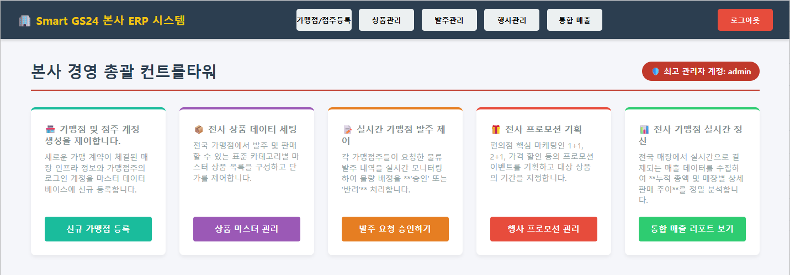

---

### 2. 가맹점 및 점주 등록

매장 정보와 점주 계정을 하나의 화면에서 등록합니다.

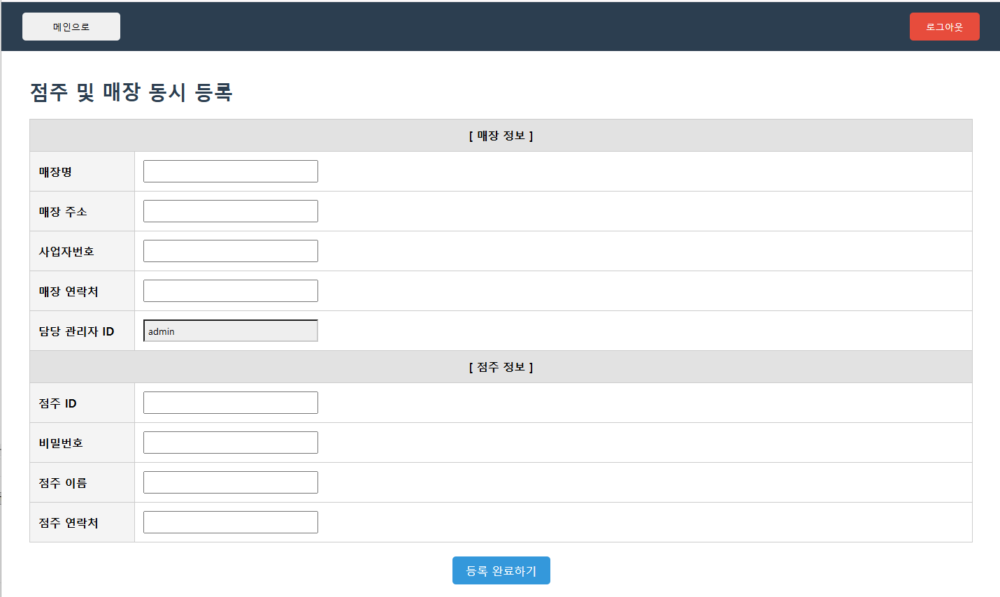

---

### 3. 상품 마스터 관리

본사에서 전체 가맹점이 사용할 상품 데이터를 등록하고 관리합니다.

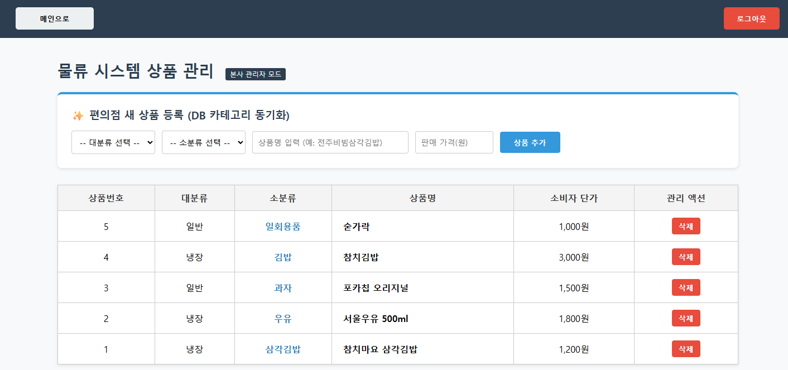

---

### 4. 상품 행사 관리

상품별 행사 종류와 행사 기간을 등록합니다.

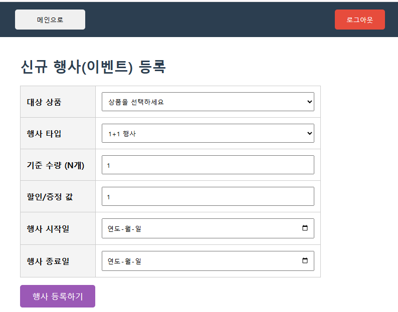

---

### 5. 가맹점 발주 관리

전국 가맹점에서 신청한 발주를 확인하고 승인 또는 반려할 수 있습니다.

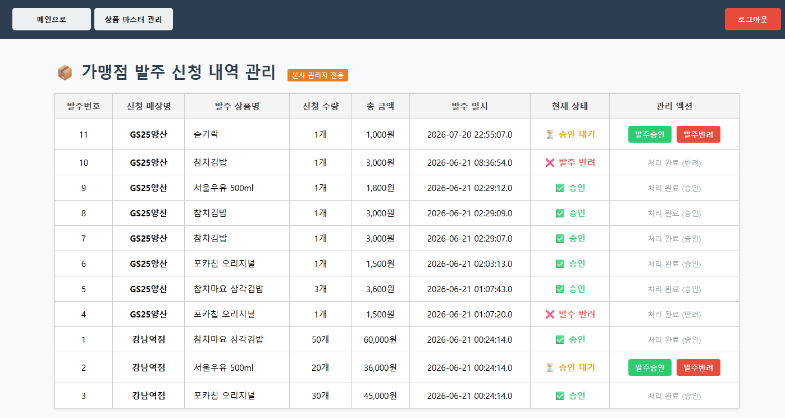

---

### 6. 통합 매출 관리

전체 가맹점에서 발생한 판매 데이터를 한 화면에서 조회합니다.

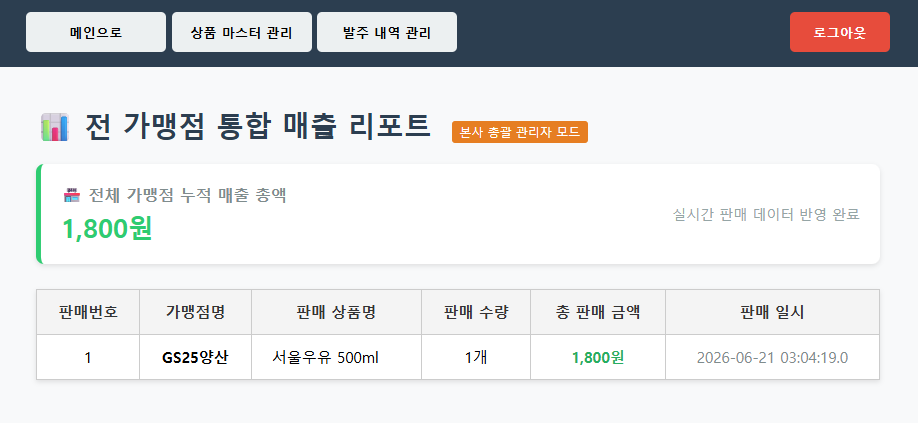

---

# 🏪 가맹점주

### 1. 가맹점주 경영 대시보드

상품 조회, 발주, 입고, 재고 조회, POS 판매 기능에 접근할 수 있습니다.

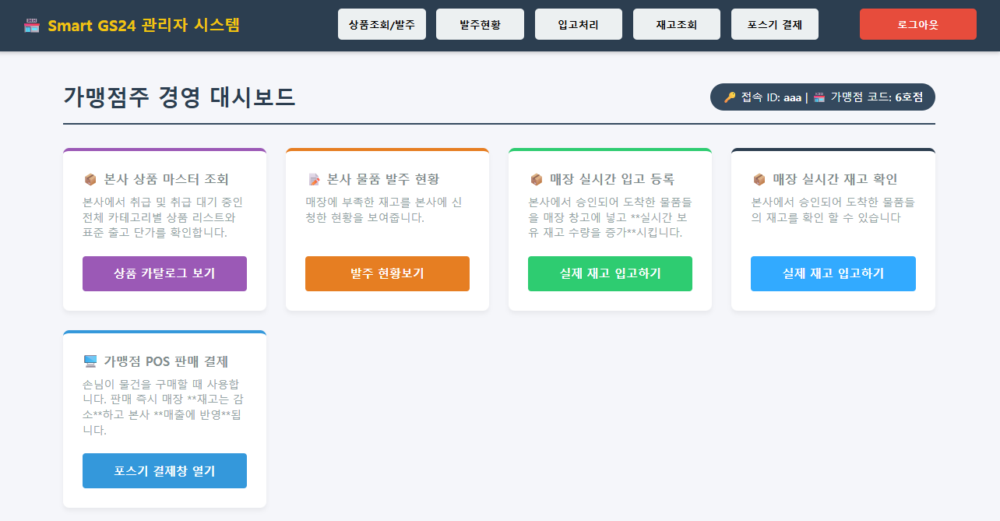

---

### 2. 상품 조회 및 발주

본사 상품 카탈로그에서 원하는 상품과 수량을 선택하여 발주합니다.

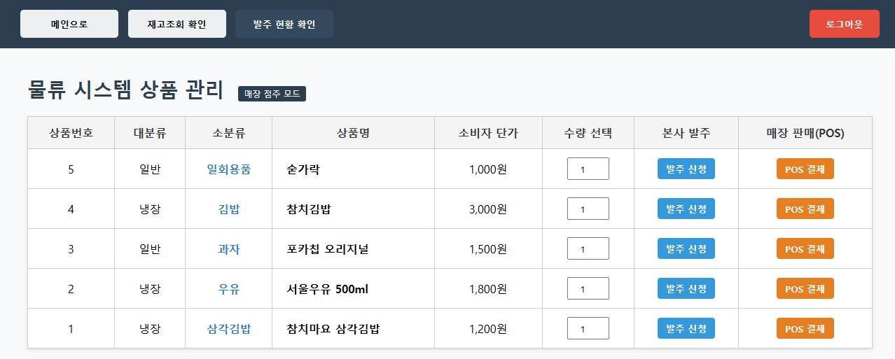

---

### 3. 발주 처리 현황

현재 매장에서 신청한 발주의 승인 및 반려 상태를 확인합니다.

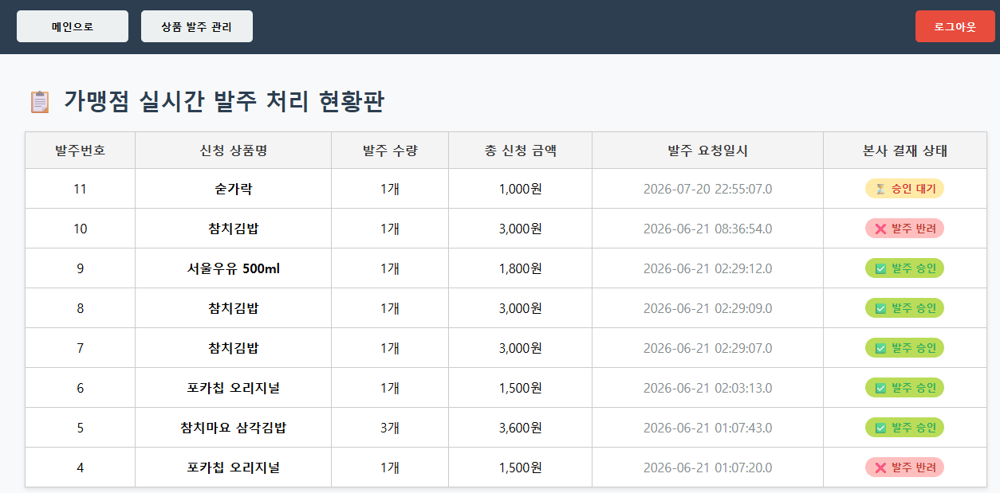

---

### 4. 물품 입고

본사에서 승인한 물품을 실제 매장 재고에 반영합니다.

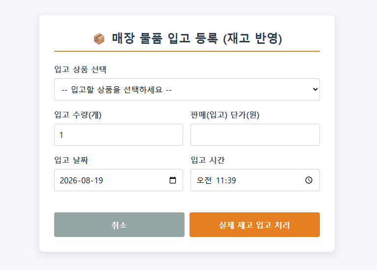

---

### 5. 매장 재고 조회

현재 매장의 상품별 보유 수량을 조회합니다.

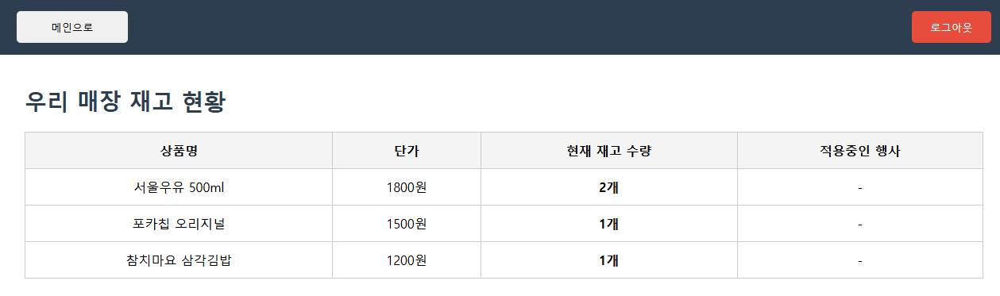

---

### 6. POS 판매

상품과 판매 수량을 선택하면 결제 예정 총 금액을 계산하고 판매 내역을 등록합니다.

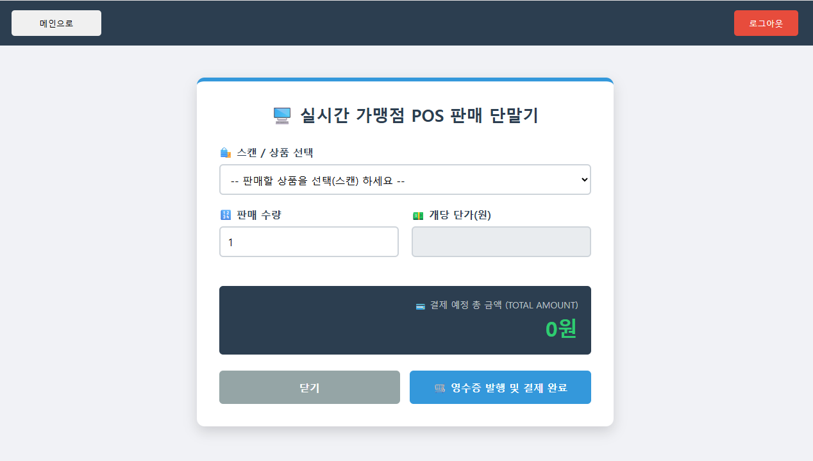

---

# 🚀 실행 환경

프로젝트 실행을 위해 다음 환경이 필요합니다.

```text
Java 21
Apache Tomcat 9
MySQL
Eclipse Dynamic Web Project
```

## Database 생성

`src/main/sql/jsp_sql.sql` 파일을 MySQL에서 실행합니다.

```sql
CREATE DATABASE jsp_project;
USE jsp_project;
```

## JNDI 설정

DAO에서 다음 JNDI Resource를 사용합니다.

```text
java:comp/env/jdbc/jsp_project
```

Tomcat에 `jdbc/jsp_project` DataSource가 연결되도록 MySQL 접속 정보를 설정해야 합니다.

---

# 🔧 개선하고 싶은 부분

현재 구현을 바탕으로 다음 기능을 추가하여 시스템을 개선할 수 있습니다.

* 비밀번호 BCrypt Hash 적용
* JSP Scriptlet 비즈니스 로직을 Servlet/Controller로 분리
* MVC 구조로 리팩터링
* POS 결제와 매장 재고 차감을 하나의 Transaction으로 통합
* 판매 수량보다 재고가 부족할 경우 POS 결제 차단
* 행사 정보를 POS 결제 금액에 자동 적용
* 발주 승인 후 동일 발주에 대한 중복 입고 방지 강화
* 매출 일별 / 월별 통계 및 Chart 구현
* 매장별 매출 비교
* 검색 / Paging 기능 추가
* 입력 데이터 Validation 강화
* 관리자 및 점주 비밀번호 변경 기능
* 로그 기록 및 예외 처리 체계 개선

---

# 📚 프로젝트를 통해 학습한 내용

이 프로젝트를 통해 단순 CRUD 구현을 넘어 여러 기능이 하나의 업무 흐름으로 연결되는 웹 시스템을 구현했습니다.

특히 다음 내용을 직접 적용했습니다.

### Java / JSP

* JSP 기반 동적 웹 페이지 구현
* Session을 활용한 로그인 상태 관리
* 사용자 권한에 따른 페이지 접근 제어
* DAO / VO를 통한 역할 분리
* Java Collection을 이용한 데이터 전달

### JDBC / Database

* JDBC 데이터베이스 연동
* JNDI DataSource 및 Connection Pool
* PreparedStatement
* ResultSet
* SQL CRUD
* INNER JOIN / LEFT JOIN
* Foreign Key
* Transaction
* Commit / Rollback
* `ON DUPLICATE KEY UPDATE`

### 시스템 설계

* 본사와 가맹점 간 업무 흐름 설계
* 사용자 역할별 권한 분리
* 매장별 데이터 격리
* 발주 상태 관리
* 입고와 재고 데이터 연계
* 상품 카테고리 관계 설계
* 판매·상품·매장 데이터 관계 설계

---

# ✅ Project Summary

Smart GS24 프로젝트에서는

```text
상품
 ↓
발주
 ↓
승인
 ↓
입고
 ↓
재고
 ↓
판매
 ↓
매출
```

로 이어지는 편의점 운영의 핵심 데이터 흐름을 웹 애플리케이션으로 구현했습니다.

특히 **관리자 / 점주 권한 분리**, **매장별 데이터 관리**, **JDBC 기반 관계형 데이터 처리**, **DB Transaction**, **JNDI Connection Pool**, **여러 테이블 JOIN을 통한 데이터 조회** 등을 직접 적용하면서 데이터베이스 기반 업무 시스템의 전체 흐름을 이해하고 구현하는 경험을 쌓았습니다.
